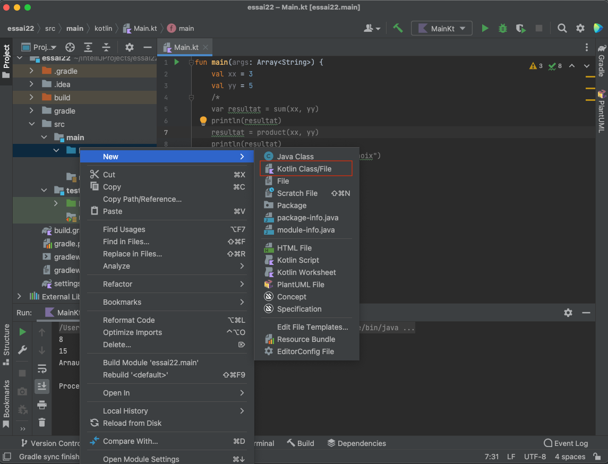

## Un second projet : manipuler plusieurs fichiers Kotlin

Créez un nouveau projet via `File > New > Project...`.  On retrouve l'assistant de création de projet.

Allez dans le dossier `src/main/kotlin/`.

Ajoutez un premier fichier Kotlin nommé `Calcul.kt` via `File > New > Kotlin Class/File` ou via un "clic droit" sur le dossier `kotlin/`, puis `New > Kotlin Class/File` ; choisissez `File`.

__ATTENTION__ choissisez bien `Kotlin Class/File` et pas `Java Class` 

*cela va très vite de se tromper ainsi, mais vous vous retrouvez avec un fichier Java au milieu de vos fichiers Kotlin.*

Ajoutez dans `Calcul.kt` le code suivant :

    fun sum(a: Int, b: Int): Int {
        return a + b
    }

    fun product(a : Int, b : Int) : Int {
        return a * b
    }

Dans le fichier `Main.kt`, utilisez les fonctions définies dans `Calcul.kt` ; par exemple :

    fun main(args: Array<String>) {
        val xx = 3
        val yy = 5
        var resultat = sum(xx, yy)
        println(resultat)
        resultat = product(xx, yy)
        println(resultat)
    }

Compilez, puis exécutez votre code.

Ajoutez une classe `Personne` ; attention à choisir `Class` dans l'assistant de création.

    class Personne (prenom : String, nom : String) {
        private var nom : String
        private var prenom : String

        init {
            this.nom = nom
            this.prenom = prenom
        }

        fun changerDeNom(nouveau : String) {
            nom = nouveau
        }

        fun donnerNomComplet() : String {
            return "$prenom $nom"
        }
    }

Modifiez le code pour que `donneNomComplet()` renvoie le `nom` en majuscule ; notez que l'éditeur va vous proposer la méthode `uppercase()` dès lors que vous commencez à taper `".up"`.

Utilisez cette classe dans `Main.kt`.

    fun main(args: Array<String>) {

        ...

        val arnaud = Personne("Arnaud", "Lanoix")
        arnaud.changerDeNom("Lanoix Brauer")
        println(arnaud.donnerNomComplet())
    }

[Exécuter des cas de tests](test.md)