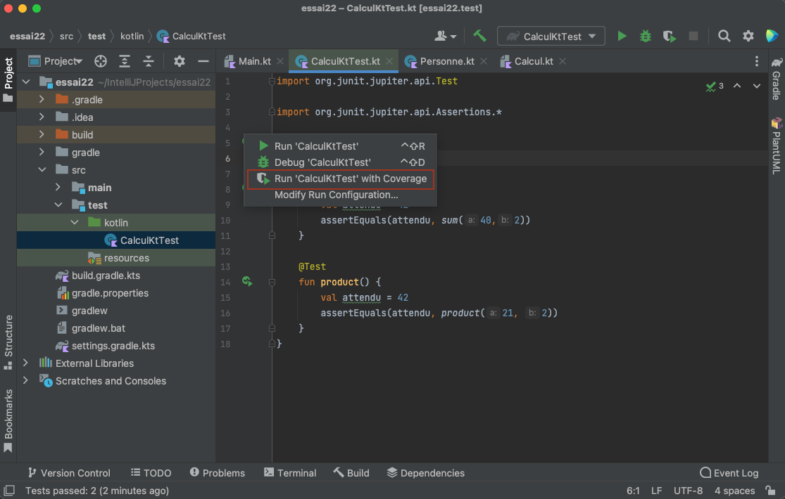
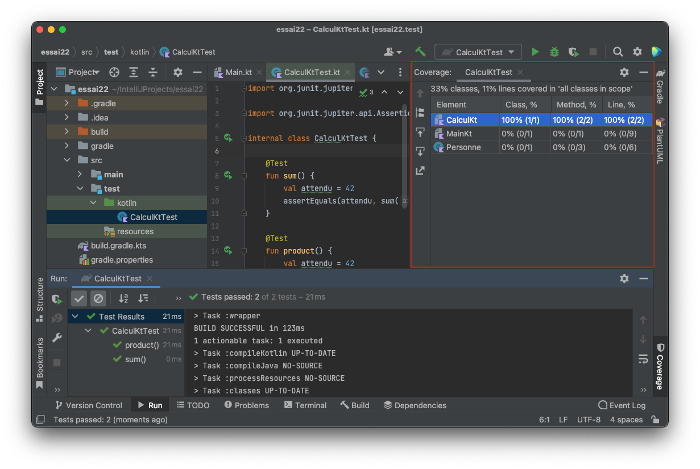

# Mesurer la couverture de code

On peut facilement mesurer la couverture de code de l'exécution ou de cas de tests, c-à-d le pourcentage de lignes de code réellement parcourues lors de l'exécution du programme.

> ***La couverture de code** donne une indication concernant la qualité du code considéré : du code jamais utilisé  est inquiétant, non ?* vous reviendrez là-dessus dans les ressources liées à la qualité et au test logiciel.

Pour mesurer la couverture du code, il suffit d'exécuter le programme ou les cas de tests en activant la fonctionnalité "Coverage".

Le résultat est donné dans un tableau donnant les pourcentages de classes, de méthodes et de lignes de code couvertes par l'exécution :

[Importer des fichiers Kotlin dans un projet](import.md)
