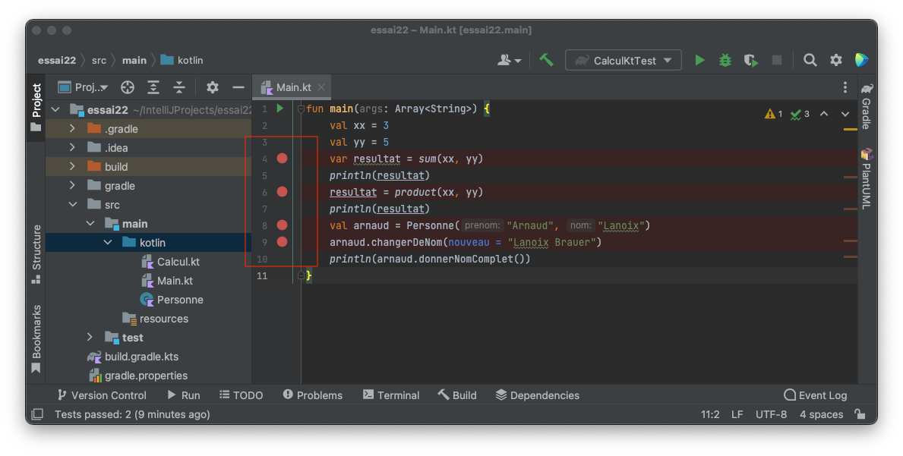
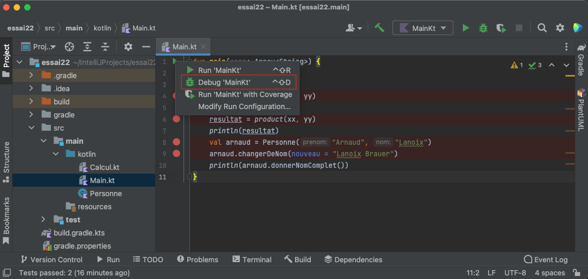
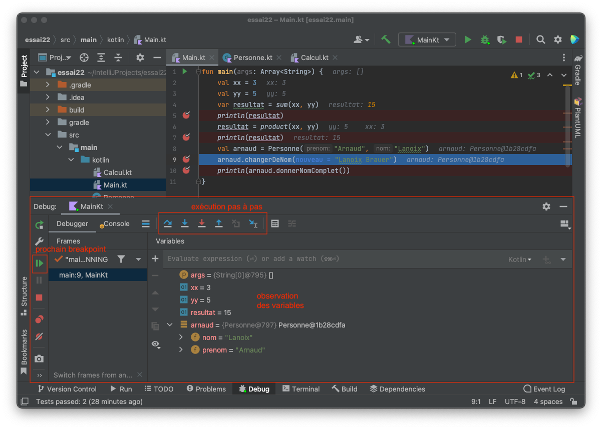

# Deboguer un programme

Il y a un debogueur intégré à IntelliJ IDEA.

*Un debogueur permet une exécution "pas à pas" du programme et d'observer l'état de chaque variable à tout instant de l'exécution.*

Dans `Main.kt`, placez des points d'arrêt (breakpoints en anglais) sur les lignes 5, 7, 9 et 10 pour observer les changements de valeur des variables `résultat` et `arnaud` : pour cela, Cliquez à côté des numéros de ligne correspondant.

Lancez le debogueur via `Run > Debug 'Main.kt'` ou "clic sur le triangle vert", puis  `Debug 'Main.kt'`

Le debogueur permet de 

- visualiser l'état de chaque variable
- exécuter jusqu'au prochain point d'arrêt
- exécuter pas à pas le programme

[Mesurer la couverture de code](coverage.md)