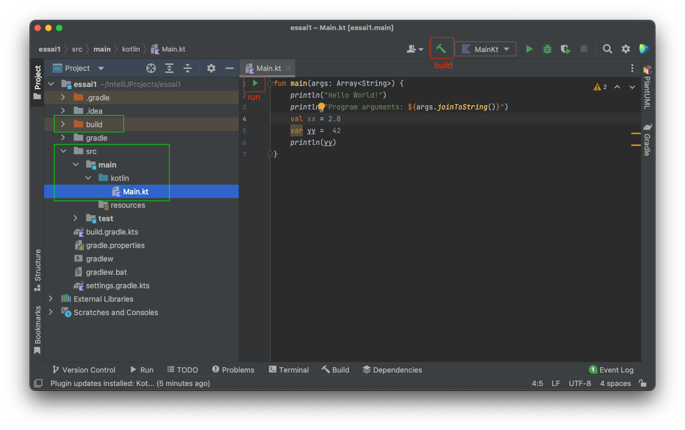
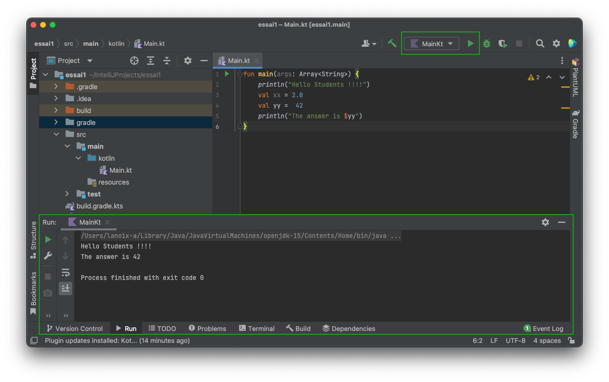
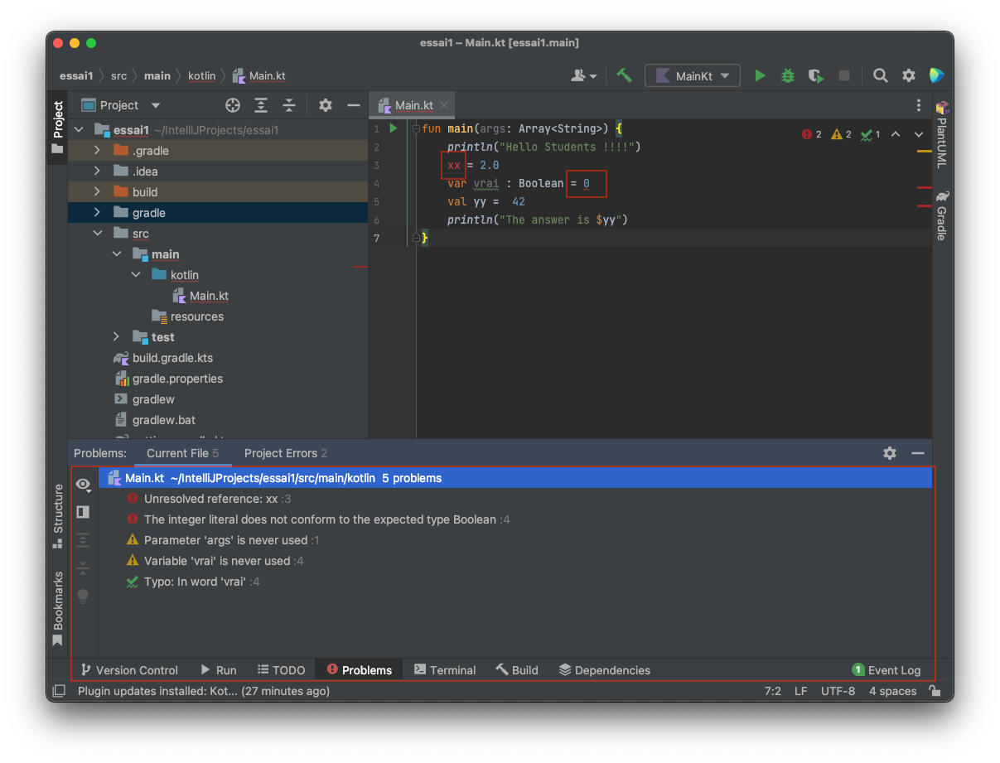
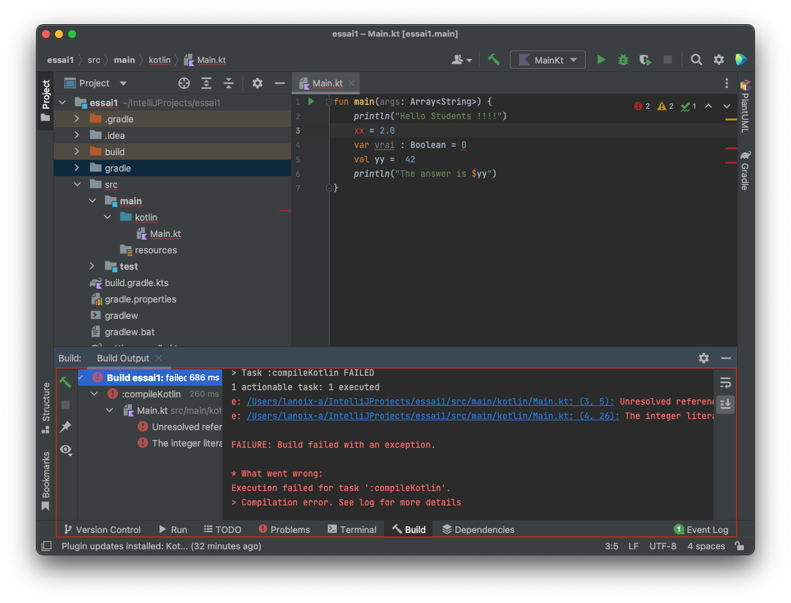

# Editer et exécuter un premier projet Kotlin

Ajoutez du code Kotlin dans le fichier `Main.Kt`.

Vous pouvez compiler le projet via le menu `Build > Build Project` ou via l'icone "marteau vert". Si ce n'est pas encore fait, cela va créer un nouveau dossier `build/` parmis tous les fichiers/dossiers.

Vous pouvez exécuter le fichier `Main.kt` via le menu `Run > Run...` ou en cliquant sur le "triangle vert" à côté de la fonction main, puis en choisissant `Run Main.kt`.

Notez qu'un `Run` est précédé d'un `Build` (si necessaire).

Une fenêtre d'exécution s'ouvre en dessous de l'éditeur.

Notez que `Main.kt` apparait maintenant dans le menu raccourci d'exécution. 

L'éditeur vous assiste dans la saisie de code Kotlin. Par exemple, il vous indique en rouge des erreurs/manques.
Des détails sont visibles dans l'onglet Problems ou en passant la souris sur l'erreur.

En cas d'erreur lors de la compilation, un onglet spécifique s'ouvrira :

[Un second projet : manipuler plusieurs fichiers Kotlin](classes.md)