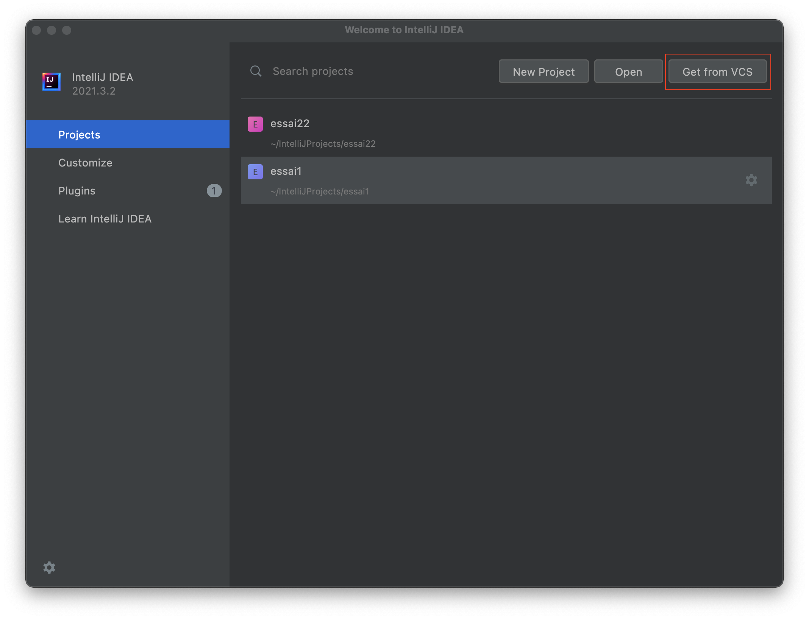
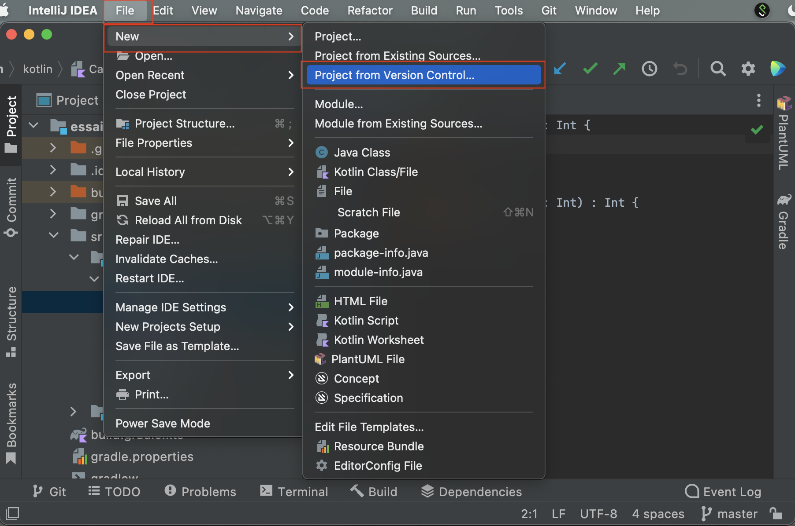
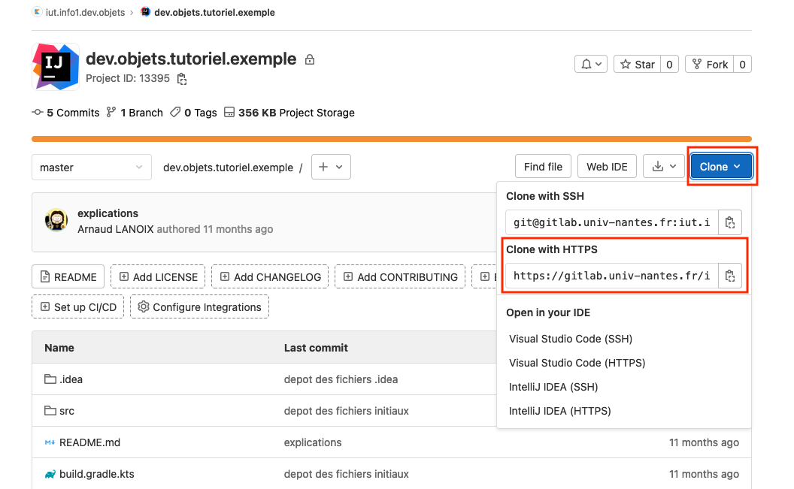

# Utiliser un gestionnaire de contrôle de version : Git

Nous allons voir comment importer dans IntelliJ IDEA un projet depuis un dépôt Git

> *Dans la ressource "Gestion de projet" (responsable JM Mottu)  vous allez aborder en détail l'usage d'un gestionnaire de version Git.*

__Attention__ il est nécessaire que le projet sur le dépôt Git soit bien un projet IntelliJ correct.

Cloner le dépôt git depuis IntelliJ IDEA

- Depuis le fenêtre de lancement listant les projets actuels disponibles, 
utilisez `Get from VCS` 

- Depuis IntelliJ, utilisez `File > New > Project from Version Control...`

Indiquez dans l'assistant VCS, l'URL  du dépôt à cloner, puis `Clone`

Essayez de cloner le dépôt [suivant](https://gitlab.univ-nantes.fr/iut.info1.dev.objets/dev.objets.tutoriel.exemple).

Sur la page web de gitlab, récupérez l'url à cloner via le bouton "Clone", puis "Clone with HTTPS" :

Pour des usages plus avancés de Git depuis IntelliJ IDEA (commit, push, merge, etc.) vous trouverez des informations détaillées par [ici](https://www.jetbrains.com/help/idea/set-up-a-git-repository.html#add-remote).

> Tous les prochains TPs/TDs machine de info1.dev.objets devront être conés ainsi.

[Installer un plugin : exemple de PlantUML](tuto/plantuml.md)

