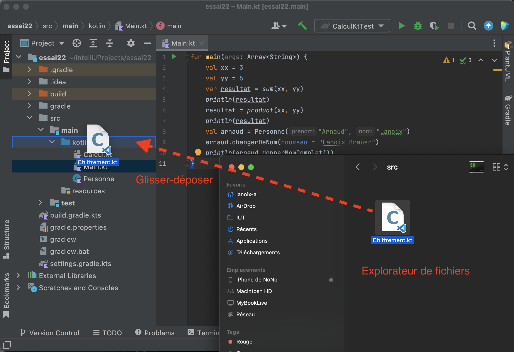
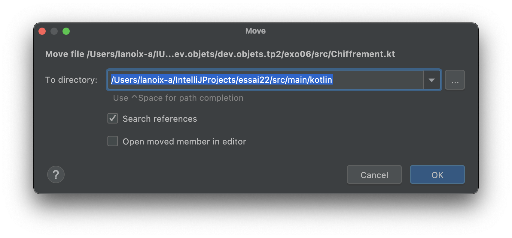
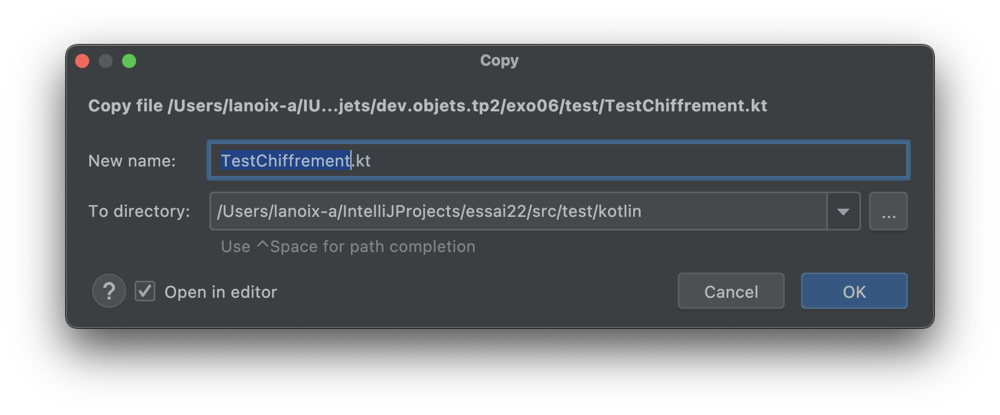

# Importer des fichiers Kotlin dans un projet

Attention, IntelliJ IDEA n'est pas qu'un simple editeur de texte, c'est un gestionnaire de projets complet. C'est la raison pour laquelle, il est important d'__ajouter correctement__ des fichiers sources Kotlin, si necessaire.

Il faut toujours commencer par créer un projet ou partir d'un projet existant.

__N'ouvrez jamais simplement un fichier source Kotlin avec IntelliJ IDEA__

Pour ajouter des fichiers source dans un projet Kotlin, le plus simple est de "glisser-déposer" le(s) fichier(s) à ajouter depuis votre explorateur de fichiers vers le dossier `src/main/kotlin/` dans IntelliJ IDEA. 

Il faut accepter le déplacement.

Vous pouvez aussi "copier" le fichier depuis votre explorateur de fichier et le "coller"
dans le dossier `src/main/kotlin/` dans IntelliJ IDEA.

Là encore, il faut accepter la copie.

__Attention__ "glisser-déposer" ou "copier-coller" uniquement dans le dossier
`src/main/kotlin/` uniquement  (ou dans `src/test/kotlin/` s'il s'agit de cas de tests)
 sinon, vos fichiers ne seront pas pris en compte par IntelliJ.

[Importer un projet IntelliJ IDEA](import_project.md)
