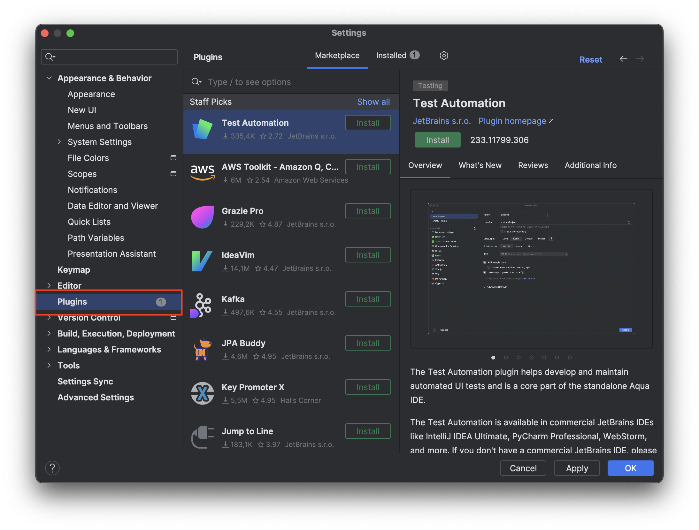
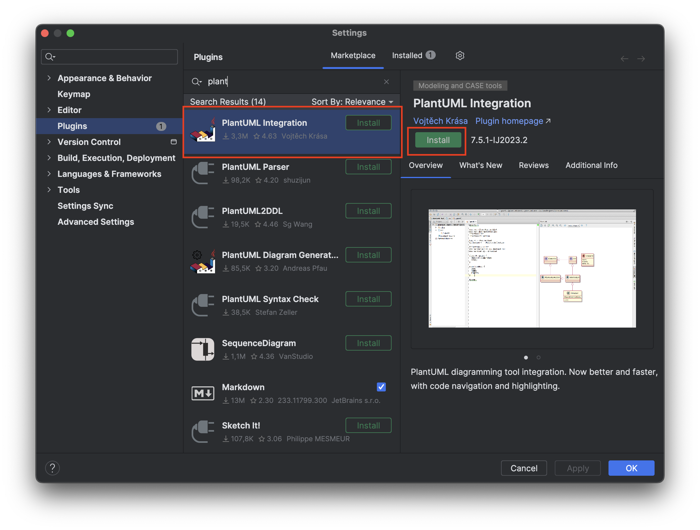
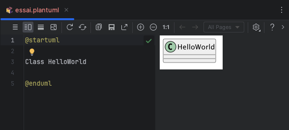

# Installer des plugins : exemple de PlantUML

Ouvrez le menu `Preferences >` et choisissez la catégorie `Plugins`

Dans le `Marketplace`, recherchez le plugin "*PlantUML integration*" et installez le. 

**NB : il faudra redémarrer IntelliJ.**

> PlantUML est un outil mode texte, de modélisation de diagrammes UML, en particulier les diagrammes de classes. Le "dessin" du diagramme est automatiquement généré par placement semi-automatiquement des différens éléments graphiques : [https://plantuml.com](https://plantuml.com/fr-dark/)

Ajoutez dans IntelliJ un nouveau fichier avec comme extension `XXX.plantuml`, puis commencez à l'éditer ; la documentation concernant l'édition d'un diagramme de classes est disponible [ici](https://plantuml.com/fr-dark/class-diagram) :

	@startuml
	
	Class HelloWorld
	
	@enduml
	

Vous pouvez également  ouvrir dans IntelliJ les fichiers présents dans les dossiers `uml/` des TPs de **dev.objets** précédents.

D'autres plugins comme **SpotBugs** peuvent vous être utiles. A vous de chercher.

[corriger des erreurs possible dans les dépendances ](tuto/dependancies.md)
