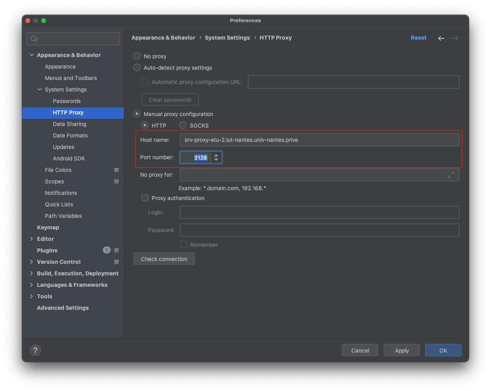

# Configurer un proxy

Sur les postes de l'IUT, il peut être nécessaire de configurer le proxy.

Selectionnez `Preferences > Appearance & Behavior > System Settings > HTTP Proxy` ; activez la configuration manuelle du proxy, et saisissez les valeurs suivantes : 

    Host name = srv-proxy-etu-2.iut-nantes.univ-nantes.prive
    Port number = 3128

